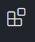

# Projeto Huddle-base 
  

Esse projeto foi feito com intuito de praticar os ensinamentos em HTML5 e CSS-flexbox avançado, dados pelo curso "dev-quest".

### o que o projeto executa:
O projeto tem como foco ajuda na pratica, o entendimento do conceito flex-box, do conceito de uma boa e limpa estrutura de código e de arquivo, criando desde um readme.md a um arquivo de responsive.css.
excelente para devs inciantes que, consiguirão contruir um código desta sua base até finaliza-lo, subindo o codigo ao github.

## Como Executar:
O projeto tem como requisitos minimos a necessidade de um editor de codigo, como Vs code por exemplo, para visualiza-lo da melhor forma. Abaixo tem um link de como instalar o vscode:

https://youtu.be/uxln1hT_Ev4 (creditos do video ao canal @devemdobro)

E dentro do Vscode, aplicar uma extensao chamada "live-server" que vai permitir visualizar em um browser o cÓdigo deste documento.

1 - Aba das extensoes:

2 - Live-server:
    

3 - Executando o código visualmente:

## Contriubuição ao codigo:
Esse código é para o cunho educativo, então, as contribuições tem quer seguir um padrão direto e simples, ficando claro por meio de comentarios no código de: "o que foi alterado", "por que essa alteração é nescessaria ou importante" ou até "recomendações de alterações".
